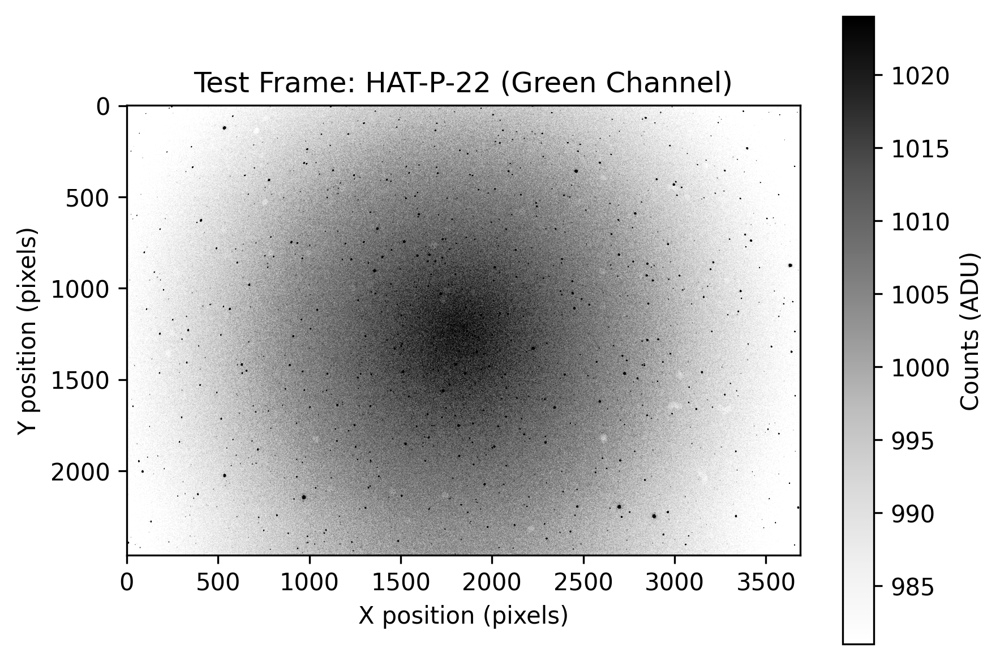

# DSLR Differential Photometry Analysis
Determining the radius of transiting exoplanets and analyzing variable stars by performing differential photometry on DSLR images.

## Project Overview
Photometry is the method used to study the brightness (flux) of stars over time. When examining stellar light curves some stars show periodic changes in their flux. These can be caused by transiting exoplanets, eclipsing binary stars, or pulsating variable stars. Approximately 75% of all exoplanets were discovered using transit photometry. NASA uses specialized space telescopes such as Kepler and TESS to capture stellar light curves and conduct photometry. 

This project aims to replicate these results using a DSLR camera and telephoto lens by conducting differential photometry analysis on HAT-P-22 and DY Pegasi. 

- HAT-P-22: located in Ursa Major, has an exoplanet called HAT-P-22 b which has an orbit of 3.2 days.
- DY Pegasi: located in the constellation Pegasus, is a pulsating variable star with a period of 1.75 hours.

## Data Capture
The images were gathered using an amateur astrophotography setup consisting of a Nikon D800 and Tamron 150-600mm lens, mounted on a Skywatcher Star Adventurer Pro for tracking. Transit timings were obtained using [Swarthmore College's Transit Finder](https://astro.swarthmore.edu/transits/). The data collected were as follows

- HAT-P-22: 665 exposures, 25 seconds, 600mm focal length, ISO 800, f/6.3. 
- DY Pegasi: 126 exposures, 30 seconds, 300mm focal length, ISO 800, f/6.

<p align="center">
  
  <br>
  <sub>A sample image taken of HAT-P-22.</sub>
</p>


## Image Preprocessing
The images were processed using [ASTAP](https://www.hnsky.org/astap.htm). The raw `.NEF` files were converted to `.fits` format via bilinear demosaicing and binned 2x2 to reduce file size and increase the signal-to-noise ratio. They were plate solved, aligned, and calibrated with darks, flats, dark flats, and bias frames. [SIMBAD](https://simbad.u-strasbg.fr/simbad/sim-fbasic) was used to identify comparison stars.

Once the files were loaded into the notebook, a zoomed in image with an aperture and annulus around the target and comparison star was created. This was done to ensure the star coordinates were correct and the size of the apertures and annuli did not overlap with any nearby stars.

<p align="center">
  
  <br>
  <sub>HAT-P-22 is pictured in the center with the comparison star HD 233728 above it.</sub>
</p>

## Photometry Method
The method for calculating the flux of an object in Analog-to-Digital Units (ADUs), $C_\text{obj}$, is defined as:

$$
C_{\text{obj}}=C_{\text{aper}}-C_{\text{sky}}=C_{\text{aper}}-N_{\text{aper}}\left( \frac{C_{\text{annul}}}{N_{\text{annul}}}  \right). \quad (1)
$$

where $C_{\text{aper}} =\text{Counts in aperture}$, $C_{\text{sky}} =\text{Background sky count}$, $C_{\text{annul}} =\text{Counts in annulus}$, $N_{\text{aper}} =\text{Pixels in aperture}$, and $N_{\text{annul}} =\text{Pixels in annulus}$

### Differential Photometry
Analyzing the flux of a single star has limitations. Imperfect viewing conditions, such as cloud cover, light polution, or atmospheric extinction, can disrupt the measured flux and disrupt the light curve data. However, measuring the flux of a nearby star and comparing its flux values to the target allows for any systematic errors to be removed. This was calculated as 

$$
\text{Relative Flux} = \frac{C_\text{target}}{C_\text{comp}}. \quad (2)
$$


## Error Analysis
Because a camera sensor measures discrete events (photon impacts) its behavior is described by Poisson statistics. For an observed number of events $s_1$, the uncertainty is $\sqrt{s_1}$. For a CMOS sensor, the error, or noise, of an image is defined as

$$
\text{Noise} = \sqrt{\text{Signal}+\text{Background}+\text{Dark}+\text{Read}^2} = \sqrt{C_\text{obj}+C_{\text{sky}} + C_\text{dark}+N_\text{aper}\sigma_\text{ron}^2}. \quad (3)
$$

$C_\text{obj}$ and $C_\text{sky}$ were calculated from Eq. 1 and the values were stored in the image analysis step. 

For short exposures on modern cameras, the dark current is negligable so $C_\text{dark} \approx 0$

### Calculating Read Noise
The read noise (an inherent property of a camera's sensor) is defined as

$$
\sigma_\text{diff} = \sqrt{2} \times \sigma _\text{ron} \implies \sigma _\text{ron} = \frac{\sigma_\text{diff}}{\sqrt{2}}. \quad (4)
$$

The method used for calculating the read noise was to subtract two bias frames (frames taken at the cameras shortest exposure) from another to remove any fixed noise patterns and calculating the the standard deviation of the resultant image. 

### ADU to Electron Conversion
Because Poisson statistics is only valid for discrete events, the data needs to be converted from ADUs to number of electrons using the camera's gain factor ($e^-$/ADU). For the Nikon D800 at 800 ISO, the gain is approximately 1.4. Multiplying the counts by the gain is necessary for the above noise equation to be valid.

### Normalizing the Noise
Just as the star's brightness was normalized, the noise value has to be normalized by the same value. Furthermore, just as the target star's relative flux was calculated using the comparison star, the final noise for the relative flux must propogate through the devision and is added in quadrature using

$$
\text{Relative Noise} = \sqrt{ \left|\frac{C_\text{target} + \text{Noise}_\text{target}}{C_\text{comp}} - \frac{C_\text{target}}{C_\text{comp}}\right| ^2 + \left|\frac{C_\text{target}}{C_\text{comp}+ \text{Noise}_\text{comp}} - \frac{C_\text{target}}{C_\text{comp}}\right| ^2}. \quad (5).
$$


## Graphing Light Curves
Finally the light curves for the target star, the comparison star, and the relative flux were all plotted.

<p align="center">
  
  <br>
  <sub>The light curves of HAT-P-22 and the comparison star HD 233728.</sub>
</p>


<p align="center">
  
  <br>
  <sub>All 3 light curves plotted together.</sub>
</p>

The light curve of HD 233728 shows an upward trend in flux followed by a dimming near the end of observation. This change in flux is used to calcualte the relative flux.

## Calculating Exoplanet Size
By measuring the transit depth and knowing the stellar radius, it is possible to determine the radius of the exoplanet using the equation

$$
\frac {\Delta L}{L} = \left ( \frac {R_P}{R_{\*}} \right) ^2 \implies R_P = R_{\*}\sqrt{\frac{\Delta L}{L}} = R_\{*} \sqrt{\text{Transit Depth}}
$$

Where $\frac{\Delta L}{L}$ is the change in flux, $R_P$ is the exoplanet radius, and $R_*$ is the star's radius.

The uncertainty in this calculation is calculated by

$$
\text{Uncertainty} = \sqrt{\left( \frac{\sigma_\text{out}}{\sqrt{N_\text{out}}} \right)^2 +\left(\frac{\sigma_\text{in}}{\sqrt{N_\text{in}}} \right)^2}
$$

Applying these calculations to HAT-P-22 b gives

<div align="center" style="border: 2px solid #4CAF50; border-radius: 10px; padding: 20px; background-color: #f9f9f9;">
  <table style="border: none; width: 60%;">
    <tr>
      <td style="text-align: right; font-weight: bold; padding-right: 20px;">Transit Depth:</td>
      <td style="text-align: left;">1.39% &plusmn; 0.01%</td>
    </tr>
    <tr>
      <td style="text-align: right; font-weight: bold; padding-right: 20px;">Measured Radius:</td>
      <td style="text-align: left;">1.176 &plusmn; 0.005 $R_{Jup}$</td>
    </tr>
    <tr>
      <td style="text-align: right; font-weight: bold; padding-right: 20px; color: gray;">Accepted Radius:</td>
      <td style="text-align: left; color: gray;">1.15 $R_{Jup}$</td>
    </tr>
  </table>
  <p style="font-size: 18px;">
    <strong>Percent Error:</strong> <span style="color: #d9534f;">2.2%</span>
  </p>
</div>

## Further Applications
Photometry can be used to identify variable stars as well. The notebook is coded such that changing the image folder and star coordinates allows easy switching between targets. Using image data taken of DY Pegasi allows observation of its variable flux.

<p align="center">
  
  <br>
  <sub>DY Pegasi in pictured in the center and HD 218587 to its left</sub>
</p>

<p align="center">
  
  <br>
  <sub>The light curves of DY Pegasi and its comparison star HD 218587</sub>
</p>

## Instructions to Run
1.  Clone the repository:
    ```bash
    git clone https://github.com/Singh-Mehtab/dslr-photometry-analysis.git
    ```
2.  Install dependencies:
    ```bash
    pip install -r requirements.txt
    ```
3.  Run the notebook:
    Open `notebooks/DSLR Photometry Analysis.ipynb` and run all cells.

The light curve data files are included in the repository under `data`. Instructions to change the settings are included in the Jupyter Notebook. Only a sample of the images are included due to their large file size.
